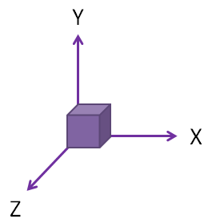
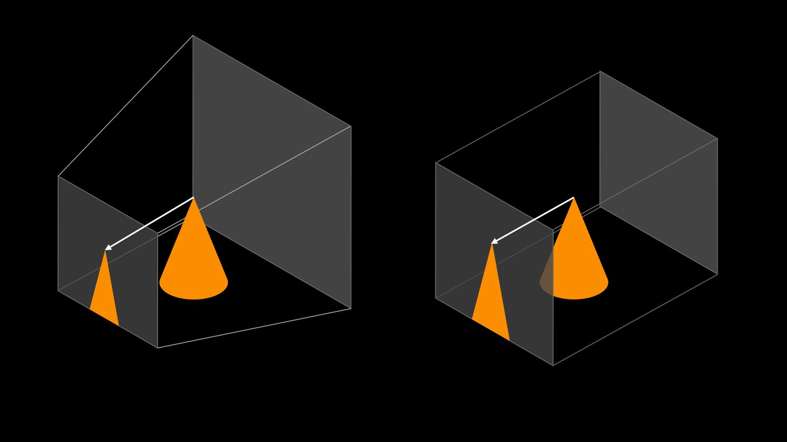

# [stacking_game](https://www.freecodecamp.org/news/render-3d-objects-in-browser-drawing-a-box-with-threejs/)

Three.js uses WebGL under the hood (v complex and low level)


There are 3 main objects in a Three.js project:

1. scene
2. camera & lighting
3. renderer

Three.js uses x, y, z coordinates like so:




# Scene 
- basically all the 3D objects
```js
const scene = new THREE.Scene();
```

# Meshes
- [Mesh](https://threejs.org/docs/?q=mesh) = [Geometry](https://threejs.org/docs/?q=geometry) + [Material](https://threejs.org/docs/?q=material)
- stuff = shape + properties
```js
// Add a cube to the scene
const geometry = new THREE.BoxGeometry(3, 1, 3); // width, height, depth
const material = new THREE.MeshLambertMaterial({ color: 0xfb8e00 });


const mesh = new THREE.Mesh(geometry, material);
mesh.position.set(0, 0, 0); // Optional, 0,0,0 is the default


scene.add(mesh);
```
### Common Geometries:
```js 
PlaneGeometry(3, 3, 32);
BoxGeometry(3, 1, 3);
CylinderGeometry(1.5, 1.5, 1, 32);
IcosahedronGeometry(1.5, 0);
ConeGeometry(1, 2, 32);
SphereGeometry(1.5, 32, 32);
```
### Common Materials:
```js 
MeshBasicMaterial() 
// can't interact w/ light, not useful
MeshLambertMaterial()
MeshPhongMaterial()
```
### Mesh Positioning
- units don't matter, as long as units are consistent throughout the code
- can change these values to animate objects
```js
mesh.position.set(x, y, z)
mesh.rotation.set(x, y, z) 
// use radians, i.e. D*(PI/180)
```

# Lighting
- for all materials other than `MeshBasicMaterial`, if no light = nothing to see

### Ambient Light
- shines from every direction, gives base color to geometry
- input: color and intensity
```js
// Set up lights
const ambientLight = new THREE.AmbientLight(0xffffff, 0.6);
scene.add(ambientLight);
```

### Directional Light
- shines from very far away (like sun), light rays parallel
- input: color, intensity
- extra setting: source direction (xyz coord)
```js
const dirLight = new THREE.DirectionalLight(0xffffff, 0.6);
dirLight.position.set(10, 20, 0); // x, y, z
scene.add(dirLight);
```

### Other light types
- PointLight
- SpotLight


# Camera
- 2 types: Perspective and Orthographic
- perspective: distorted; further = smaller, closer = bigger
- orthographic: undistorted; parallel light remain parallel

"view frustum", basically defined by a near and far viewing plane:


(Left - Perspective, Right - Orthographic)

### Perspective
- projected towards viewpoint in a staight line
- input: FOV (angle from bottom to top), aspect ratio, distance to near plane, distance to far plane

```js
// Perspective camera
const aspect = window.innerWidth / window.innerHeight;
const camera = new THREE.PerspectiveCamera(
  45, // field of view in degrees
  aspect, // aspect ratio
  1, // near plane
  100 // far plane
);
```

### Orthographic
- projected onto a surface
- input: distance of each plane from the viewpoint, near plane and far plane

```js
// Orthographic camera
const width = 10;
const height = width * (window.innerHeight / window.innerWidth);
const camera = new THREE.OrthographicCamera(
  width / -2, // left
  width / 2, // right
  height / 2, // top
  height / -2, // bottom
  1, // near
  100 // far
);

```

Both cameras need to be positioned and set in a direction.

```js
camera.position.set(4, 4, 4);
camera.lookAt(0, 0, 0);
```

** If orthographic cam, the numbers don't matter - direction does (just like directional light)


# Renderer 
- define a WebGLRenderer to put image into HTML canvas
```js
// Renderer
const renderer = new THREE.WebGLRenderer({ antialias: true });
renderer.setSize(window.innerWidth, window.innerHeight);
renderer.render(scene, camera);

// Add it to HTML
document.body.appendChild(renderer.domElement);
```
